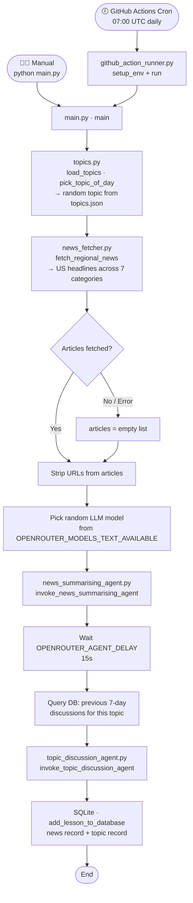
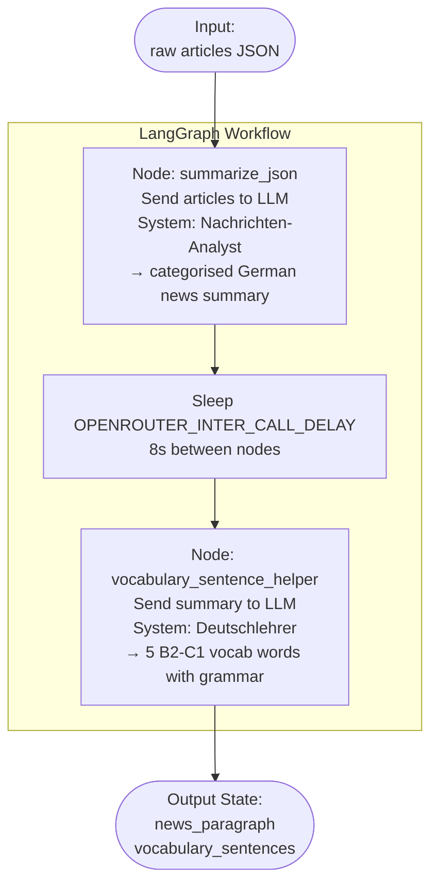
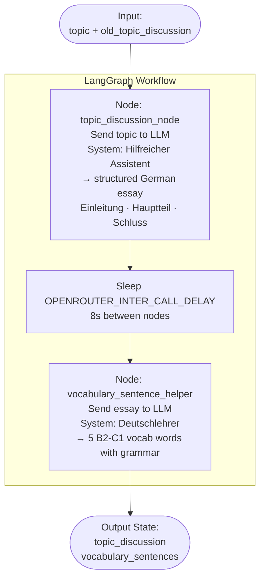
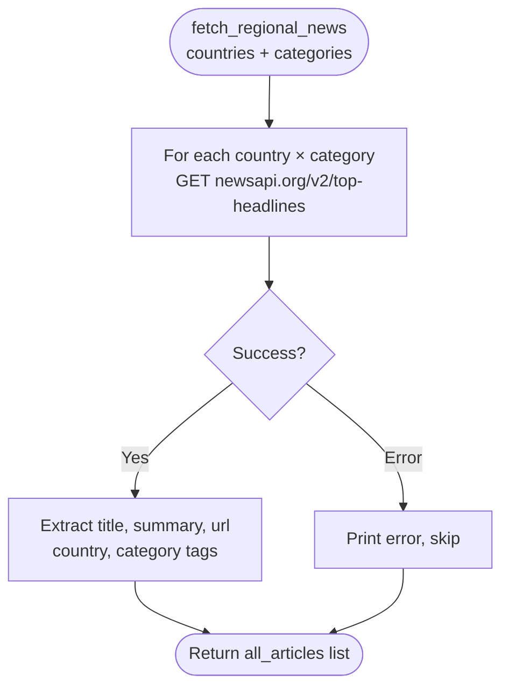
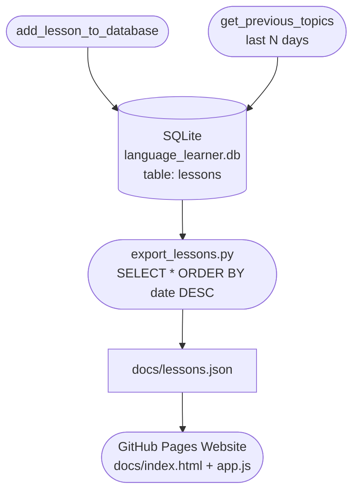
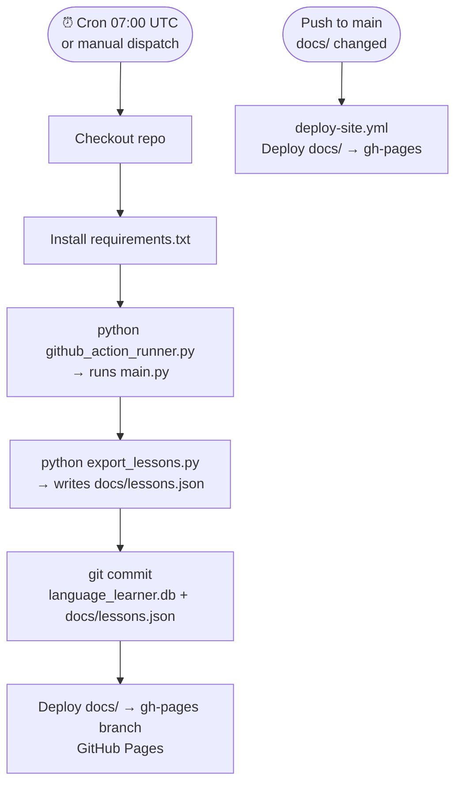
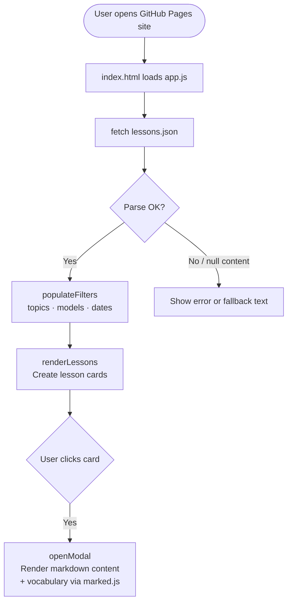
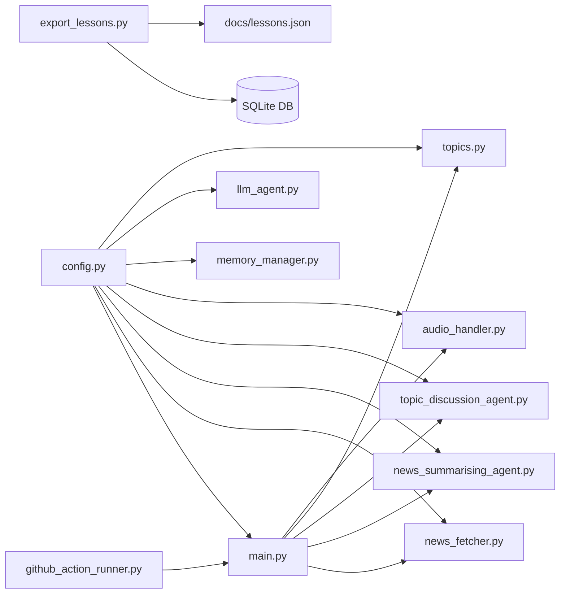

# 🇩🇪 German Language Learner – Codebase Flowchart

## Overview

Two entry points exist: **manual** (`python main.py`) and **automated** (GitHub Actions cron at 07:00 UTC daily). Both converge on `main.py`.

---

## 1. Top-Level Execution Flow



---

## 2. News Summarising Agent (LangGraph)

Called from `main.py` with the scraped articles JSON.



---

## 3. Topic Discussion Agent (LangGraph)

Called from `main.py` with today's topic and past 7-day discussion history.



---

## 4. OpenRouter API Call with Retry Logic

Used inside both agents — every single LLM call goes through this.

```mermaid
flowchart TD
    A([Call _invoke_openrouter\nsystem_text + user_text]) --> B[Build headers + payload\nPOST openrouter.ai/chat/completions]
    B --> C{HTTP response}

    C -- 200 OK --> D[Parse response JSON\nextract choices[0].message.content]
    D --> E{Content present?}
    E -- Yes --> F([Return text])
    E -- No --> G([Return fallback string])

    C -- 429 Rate Limit --> H{attempt < max_retries?}
    H -- Yes --> I[Sleep BASE_DELAY × 2^attempt\n3s · 6s · 12s · 24s · 48s · 96s]
    I --> B
    H -- No --> J([Return fallback string])

    C -- Other HTTP Error --> K([Raise exception])
    C -- Network Error --> H
```

---

## 5. News Fetcher



---

## 6. SQLite Database

All lessons are persisted in `language_learner.db`.



---

## 7. GitHub Actions CI/CD



---

## 8. Website Frontend (`docs/`)



---

## 9. Config & Module Dependency Map



---

## 10. Data Flow Summary

```
NewsAPI ──────────────────────────────────────────────────────┐
                                                              ↓
topics.json → pick random topic                         raw articles JSON
                    ↓                                         ↓
             main.py ←───────────── random LLM model ────────┘
                    │
          ┌─────────┴──────────┐
          ↓                    ↓
  news_summarising        topic_discussion
     _agent.py               _agent.py
          │                    │
     [LangGraph]           [LangGraph]
    summarize →            discuss topic →
    vocabulary             vocabulary
          │                    │
          └─────────┬──────────┘
                    ↓
          SQLite language_learner.db
                    ↓
          export_lessons.py
                    ↓
          docs/lessons.json
                    ↓
          GitHub Pages Website
```
